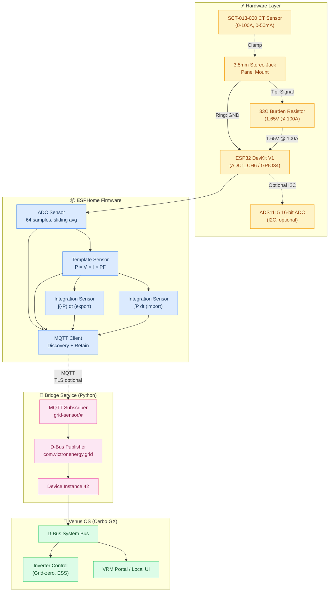
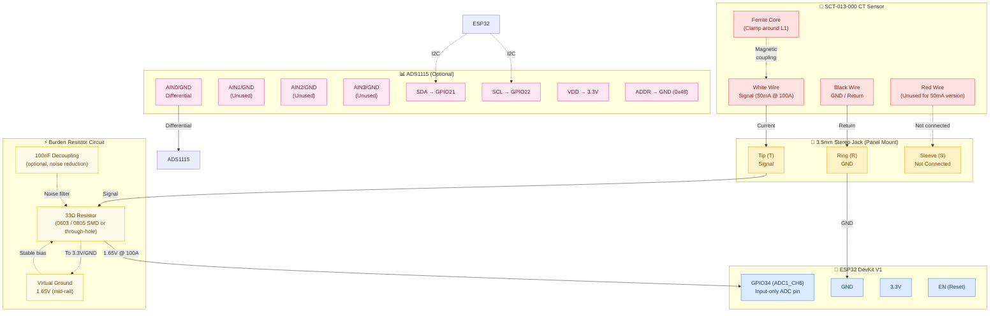

# dbus-esphome-grid-sensor

[](https://github.com/victron-venus/dbus-esphome-grid-sensor/releases)
[](LICENSE)
[](pyproject.toml)
[](https://esphome.io/)
[](https://www.victronenergy.com/live/venus-os:start)
[](docker-compose.yml)

ESP32-based Current Transformer (CT) sensor for monitoring household grid power, with a companion D-Bus service that registers it as a grid meter (`com.victronenergy.grid`) in Victron Venus OS.

## Architecture



## Features

- **Real-time grid monitoring**: Power (W), Voltage (V), Current (A), Energy (kWh)
- **Feed-in detection**: Automatic detection of grid export (negative power)
- **Venus OS integration**: Registers as standard `com.victronenergy.grid` device
- **ESPHome firmware**: OTA updates, WiFi fallback AP, MQTT discovery
- **Calibration support**: Adjustable CT calibration via substitutions
- **Optional ADS1115**: Higher resolution 16-bit ADC support
- **Docker deployment**: Containerized D-Bus service for Venus OS
- **Systemd/daemontools**: Production-ready service management

## Hardware Requirements

| Component | Specification | Notes |
|-----------|---------------|-------|
| ESP32 | DevKit V1, ESP32-S3, or similar | Any ESP32 with ADC (GPIO34 input-only) |
| CT Sensor | SCT-013-000 (100A, 50mA output) | Or compatible 0-50mA CT |
| Burden Resistor | 33Ω (3.3V ADC) / 100Ω (5V+divider) | Calculated for 1.65V at 100A |
| 3.5mm Jack | Stereo, panel mount | For CT connection |
| Optional | ADS1115 (16-bit ADC) | For better resolution |

## Wiring Diagram



### Pinout Summary

| CT Wire | Jack Pin | ESP32 Pin | Function |
|---------|----------|-----------|----------|
| White (Signal) | Tip | GPIO34 + 33Ω to 1.65V | CT Signal |
| Black (GND) | Ring | GND | Ground reference |
| Red | Sleeve | — | Not connected |

### Burden Resistor Calculation

For SCT-013-000 (100A = 50mA secondary):
- Target: 1.65V at 100A (mid-rail on 3.3V ADC)
- Burden = V / I = 1.65V / 0.05A = **33Ω**

> **Note**: Use 1% metal film resistor. Place close to ESP32 pin. Add 100nF capacitor from signal to GND for noise reduction.

## Quick Start

### 1. Configure ESPHome

```bash
cd esphome
cp secrets.yaml.example secrets.yaml
# Edit secrets.yaml with your WiFi/MQTT credentials
```

Key substitutions in `grid-sensor.yaml`:
```yaml
substitutions:
  device_name: "grid-sensor"
  friendly_name: "Grid Power Sensor"
  ct_calibration: "60.6"  # A/V - calibrate with known load
  nominal_voltage: "230"  # Your grid voltage
```

### 2. Flash ESPHome Firmware

```bash
esphome run grid-sensor.yaml
# Or for OTA after first flash:
esphome run --device <IP> grid-sensor.yaml
```

### 3. Run D-Bus Service (Docker)

```bash
cd ..
docker compose up -d
```

### 4. Verify in Venus OS

Check D-Bus:
```bash
dbus-spy com.victronenergy.grid.42
```

Or via MQTT:
```bash
mosquitto_sub -t 'grid-sensor/#' -v
```

## Configuration

### Environment Variables (D-Bus Service)

| Variable | Default | Description |
|----------|---------|-------------|
| `MQTT_BROKER` | `localhost` | MQTT broker hostname |
| `MQTT_PORT` | `1883` | MQTT broker port |
| `MQTT_USERNAME` | `` | MQTT username (optional) |
| `MQTT_PASSWORD` | `` | MQTT password (optional) |
| `MQTT_TOPIC_PREFIX` | `grid-sensor` | MQTT topic prefix |
| `DBUS_INSTANCE` | `42` | D-Bus device instance |
| `DEVICE_INSTANCE` | `42` | Venus OS device instance |
| `CUSTOM_NAME` | `ESPHome CT Grid Sensor` | Display name |
| `RECONNECT_DELAY` | `5` | MQTT reconnect delay (seconds) |

### ESPHome Substitutions

| Substitution | Default | Description |
|--------------|---------|-------------|
| `ct_calibration` | `60.6` | Current calibration (A/V) |
| `nominal_voltage` | `230` | Grid voltage for power calc |
| `wifi_ssid` | *required* | WiFi SSID |
| `wifi_password` | *required* | WiFi password |
| `mqtt_broker` | *required* | MQTT broker IP |
| `mqtt_port` | `1883` | MQTT port |

## Calibration Procedure

1. **Connect known load** (e.g., 2000W heater = ~8.7A at 230V)
2. **Monitor raw ADC** via ESPHome logs or MQTT
3. **Calculate calibration**: `calibration = known_current / measured_voltage`
4. **Update `ct_calibration`** substitution and re-flash
5. **Verify** power reading matches expected value

### Using ADS1115 (Optional)

Uncomment in `grid-sensor.yaml`:
```yaml
ads1115:
  - address: 0x48
    i2c_id: bus_a
    id: ads1115_1

sensor:
  - platform: ads1115
    ads1115_id: ads1115_1
    multiplexer: "A0_GND"
    name: "Grid Current ADS1115"
    gain: 4.096
```

ADS1115 provides ~0.0625mV/LSB vs ESP32 ~0.8mV/LSB (12-bit).

## MQTT Topics

| Topic | Payload | Description |
|-------|---------|-------------|
| `grid-sensor/power` | `{"power": 1250}` | AC Power (W) |
| `grid-sensor/voltage` | `{"voltage": 232.5}` | Voltage (V) |
| `grid-sensor/current` | `{"current": 5.4}` | Current (A) |
| `grid-sensor/energy_forward` | `{"energy_forward": 45.2}` | Imported energy (kWh) |
| `grid-sensor/energy_reverse` | `{"energy_reverse": 12.1}` | Exported energy (kWh) |
| `grid-sensor/status` | `{"status": "online"}` | Connection status |
| `grid-sensor/diagnostics` | `"Current: 5.4A, Power: 1250W..."` | Text diagnostics |

## D-Bus Paths (com.victronenergy.grid)

| Path | Type | Description |
|------|------|-------------|
| `/Ac/Power` | float | Total power (W, +import/-export) |
| `/Ac/L1/Power` | float | L1 power (W) |
| `/Ac/L1/Voltage` | float | L1 voltage (V) |
| `/Ac/L1/Current` | float | L1 current (A) |
| `/Ac/Energy/Forward` | float | Imported energy (kWh) |
| `/Ac/Energy/Reverse` | float | Exported energy (kWh) |
| `/Ac/Frequency` | float | Grid frequency (Hz) |
| `/Status` | int | 0=OK, 1=Warning, 2=Error |
| `/Connected` | int | 1=connected, 0=disconnected |
| `/ErrorCode` | int | 0=none, 1=disconnected |
| `/DeviceInstance` | int | Device instance |
| `/CustomName` | string | User-defined name |

## Installation on Venus OS

### Using install.sh (Recommended)

```bash
./install.sh
```

This installs:
- D-Bus service to `/opt/victronenergy/dbus-grid-service/`
- Daemontools service to `/service/dbus-grid-service/`
- Systemd service (if systemd available)

### Manual Installation

```bash
# Copy files
mkdir -p /opt/victronenergy/dbus-grid-service
cp src/dbus_grid_service.py /opt/victronenergy/dbus-grid-service/
cp service/run /opt/victronenergy/dbus-grid-service/

# Create daemontools service
mkdir -p /service/dbus-grid-service
ln -s /opt/victronenergy/dbus-grid-service/run /service/dbus-grid-service/run

# Or systemd
cp service/dbus-grid-service.service /etc/systemd/system/
systemctl enable --now dbus-grid-service
```

## Docker Deployment

```yaml
# docker-compose.yml
services:
  dbus-grid-service:
    build: .
    environment:
      - MQTT_BROKER=mosquitto
      - MQTT_PORT=1883
      - DBUS_INSTANCE=42
      - DEVICE_INSTANCE=42
    volumes:
      - /var/run/dbus:/var/run/dbus
    network_mode: host
    restart: unless-stopped
```

## Comparison with Commercial Grid Meters

| Feature | ESPHome CT | Carlo Gavazzi EM24 | Shelly 3EM | Victron Energy Meter |
|---------|-----------|-------------------|------------|---------------------|
| Cost | ~$25 | ~$150 | ~$100 | ~$200 |
| Phases | 1 (L1 only) | 3 | 3 | 3 |
| Accuracy | ±2-5% | ±0.5% | ±1% | ±0.5% |
| Venus OS Native | ✓ D-Bus | ✓ D-Bus | ✓ MQTT | ✓ D-Bus |
| Open Source | ✓ | ✗ | ✗ | ✗ |
| Calibration | Manual | Factory | App | Factory |
| Installation | DIY (CT clamp) | Pro (wired) | DIY (CT clamp) | Pro (wired) |

## Project Structure

```
dbus-esphome-grid-sensor/
├── esphome/
│   └── grid-sensor.yaml          # ESPHome firmware
├── src/
│   └── dbus_grid_service.py      # D-Bus service (Python)
├── service/
│   └── run                       # Daemontools service script
├── tests/
│   └── test_dbus_service.py      # Unit tests
├── docker-compose.yml            # Docker deployment
├── Dockerfile                    # Container image
├── install.sh                    # Venus OS installer
├── pyproject.toml                # Python package config
├── LICENSE                       # MIT License
└── README.md                     # This file
```

## Contributing

1. Fork the repository
2. Create a feature branch
3. Make your changes
4. Run tests: `pytest`
5. Submit a PR

## License

MIT License - see [LICENSE](LICENSE) for details.

## Related Projects

- [inverter-control](https://github.com/victron-venus/inverter-control) - Grid-zero feed-in control
- [inverter-dashboard-go](https://github.com/victron-venus/inverter-dashboard-go) - Real-time web dashboard
- [dbus-mqtt-battery](https://github.com/victron-venus/dbus-mqtt-battery) - BMS D-Bus integration
- [venus-os-observability](https://github.com/victron-venus/venus-os-observability) - OpenTelemetry monitoring